# Smart HR Attendance & Payroll Management

<div align="center">

# Smart HR  
**Business-Oriented HR Operations Platform for Attendance, Payroll, Leave, Scheduling, Overtime, and AI-Assisted Review**


</div>

---

## Business Production Highlights

Smart HR is not a basic CRUD demo. It is designed as a **business-style, multi-workspace HR platform** with:

- **4 role experiences**: Admin, HR, Manager, Employee
- **separate portals and navigation flows** instead of one overloaded dashboard
- **attendance, leave, payroll, overtime, and scheduling workflows**
- **approval and audit-aware operations**
- **manager scope restrictions**
- **self-service portal for employees**
- **AI Payroll Summary Assistant** for payroll anomaly and executive-style review
- **engineering depth** through JWT auth, refresh token, cache, logging direction, audit direction, and Docker readiness

This project is suitable for:

- thesis / capstone / final project demonstration
- portfolio / GitHub showcase
- CV project description
- interview discussion around business rules and system design

---

## Table of Contents

- [Business Production Highlights](#business-production-highlights)
- [Project Overview](#project-overview)
- [Main Roles](#main-roles)
- [Feature Coverage](#feature-coverage)
- [AI Payroll Summary Assistant](#ai-payroll-summary-assistant)
- [Business Rules](#business-rules)
- [Tech Stack](#tech-stack)
- [Architecture Diagram (Text)](#architecture-diagram-text)
- [Project Tree](#project-tree)
- [Screenshots](#screenshots)
- [Demo Accounts / Notes](#demo-accounts--notes)
- [How to Run Locally](#how-to-run-locally)
- [Optional Docker Run](#optional-docker-run)
- [API Coverage Summary](#api-coverage-summary)
- [Engineering Depth](#engineering-depth)
- [Suggested Demo Flow](#suggested-demo-flow)
- [Future Improvements](#future-improvements)

---

## Project Overview

**Smart HR** is a role-based HR management platform that helps organizations manage:

- employee records
- department and position structures
- attendance tracking
- attendance adjustment workflows
- payroll generation and payroll review
- leave request workflows
- overtime requests and approvals
- shift and schedule assignments
- reports, summaries, and exports
- audit-oriented activity review
- AI-generated payroll summaries

The project separates **operational users** from **self-service users**:

- **Admin / HR / Manager** work in a business workspace
- **Employee** works in a self-service portal

This design makes the system more realistic, clearer to use, and easier to scale into a production-like HR platform.

---

## Main Roles

### Role Summary

| Role | Scope | Main Purpose | Workspace |
|------|-------|--------------|-----------|
| **Admin** | Organization-wide | Full operational and governance control | Admin / HR Business Workspace |
| **HR** | Organization-wide HR operations | Daily HR workflows, payroll support, leave/attendance review | Admin / HR Business Workspace |
| **Manager** | Assigned department/team scope | Scoped approval and monitoring | Admin / HR Business Workspace |
| **Employee** | Personal records only | Self-service access to attendance, payroll, leave, overtime, and profile | Employee Self-Service Portal |

### Role Capabilities Matrix

| Feature / Permission | Admin | HR | Manager | Employee |
|----------------------|:-----:|:--:|:-------:|:--------:|
| View business dashboard | ✅ | ✅ | ✅ | ❌ |
| View self-service dashboard | ❌ | ❌ | ❌ | ✅ |
| Manage employees | ✅ | ✅ | ❌ | ❌ |
| Manage departments | ✅ | ✅ | ❌ | ❌ |
| Manage positions | ✅ | ✅ | ❌ | ❌ |
| View attendance records | ✅ | ✅ | Scoped | Self only |
| Add / edit / delete attendance | ✅ | ✅ | ❌ | ❌ |
| Submit attendance adjustment request | ❌ | ❌ | ❌ | ✅ |
| Review attendance adjustment requests | ✅ | ✅ | Scoped | ❌ |
| View payroll records | ✅ | ✅ | Scoped | Self only |
| Generate payroll | ✅ | ✅ | ❌ | ❌ |
| Review payroll summaries | ✅ | ✅ | Scoped | ❌ |
| Use AI Payroll Summary Assistant | ✅ | ✅ | Scoped / optional | ❌ |
| Submit leave requests | ❌ | ❌ | ❌ | ✅ |
| Approve / reject leave requests | ✅ | ✅ | Scoped | ❌ |
| View leave history | ✅ | ✅ | Scoped | Self only |
| Submit overtime requests | ❌ | ❌ | ❌ | ✅ |
| Approve / reject overtime requests | ✅ | ✅ | Scoped | ❌ |
| View schedules and shifts | ✅ | ✅ | Scoped | Self / assigned only |
| Manage shift catalog | ✅ | ✅ | ❌ | ❌ |
| Manage schedule assignments | ✅ | ✅ | ❌ | ❌ |
| Access reports page | ✅ | ✅ | Scoped | ❌ |
| Export reports | ✅ | ✅ | Scoped | Self-service exports only |
| Update personal profile | ❌ | ❌ | ❌ | ✅ |
| Change password | ✅ | ✅ | ✅ | ✅ |

### Role Notes

- **Admin** has the highest level of access and can operate across all HR modules.
- **HR** works in the same business workspace as Admin but focuses on operational HR workflows.
- **Manager** is restricted to assigned department/team scope and should not access out-of-scope data.
- **Employee** only works inside the self-service portal and can only access personal records and requests.

## Tech Stack

### Backend
- ASP.NET Core Web API
- C#
- Entity Framework Core
- SQL Server
- JWT Authentication
- Refresh Token direction
- Redis Cache direction
- service layer
- DTO-based request/response structure

### Frontend
- HTML
- CSS
- JavaScript
- Bootstrap 5
- Bootstrap Icons
- Chart.js

### Dev / Ops
- Visual Studio / .NET 8 SDK
- Docker
- Docker Compose

---

## Architecture Diagram (Text)

```text
┌──────────────────────────────────────────────────────────────┐
│                        Smart HR Frontend                     │
│                                                              │
│   ┌──────────────────────┐    ┌──────────────────────────┐   │
│   │ Admin / HR / Manager │    │ Employee Self-Service    │   │
│   │ wwwroot/admin/*      │    │ wwwroot/employee/*       │   │
│   └──────────┬───────────┘    └────────────┬─────────────┘   │
└──────────────┼─────────────────────────────┼─────────────────┘
               │                             │
               └──────────────┬──────────────┘
                              │ HTTP / JWT
                              ▼
┌──────────────────────────────────────────────────────────────┐
│                 ASP.NET Core Web API Backend                 │
│                                                              │
│  Controllers   Services   DTOs   Middleware   Validation    │
│                                                              │
│  - Auth                                             - Logs   │
│  - Dashboard                                        - Audit  │
│  - Employees                                        - Cache  │
│  - Attendances                                      - AI     │
│  - Payrolls                                                 │
│  - LeaveRequests                                            │
│  - Departments / Positions                                  │
│  - Reports / Overtime / Schedule direction                  │
└──────────────┬───────────────────────────────┬───────────────┘
               │                               │
               ▼                               ▼
      ┌───────────────────┐          ┌────────────────────┐
      │   SQL Server DB   │          │     Redis Cache    │
      │ Employees         │          │ Dashboard cache    │
      │ Attendances       │          │ Report cache       │
      │ LeaveRequests     │          │ Leave balance      │
      │ Payrolls          │          │ AI summary cache   │
      │ Positions         │          └────────────────────┘
      │ RefreshTokens     │
      │ Shift / Schedule  │
      │ Overtime          │
      └───────────────────┘
```

---

## Project Tree

```text
smart_hr_attendance&payroll_management/
├── Controllers/
│   ├── AuthController.cs
│   ├── DashboardController.cs
│   ├── EmployeesController.cs
│   ├── AttendancesController.cs
│   ├── LeaveRequestsController.cs
│   ├── PayrollsController.cs
│   ├── DepartmentsController.cs
│   ├── PositionsController.cs
│   └── ...
├── Data/
│   ├── AppDbContext.cs
│   ├── DbSeeder.cs
│   └── ...
├── DTOs/
│   ├── LoginRequest.cs
│   ├── PayrollResponse.cs
│   ├── LeaveRequestResponse.cs
│   ├── EmployeeProfileResponse.cs
│   └── ...
├── Entities/
│   ├── AppUser.cs
│   ├── Employee.cs
│   ├── Attendance.cs
│   ├── LeaveRequest.cs
│   ├── Payroll.cs
│   ├── Position.cs
│   ├── RefreshToken.cs
│   └── ...
├── Middleware/
│   └── ...
├── Models/
│   └── JwtSettings.cs
├── Services/
│   ├── PasswordService.cs
│   ├── TokenService.cs
│   ├── LeaveBalancePolicyService.cs
│   ├── PayrollComputationService.cs
│   └── ...
├── Validation/
│   └── ...
├── wwwroot/
│   ├── admin/
│   │   ├── overview.html
│   │   ├── employees.html
│   │   ├── attendances.html
│   │   ├── payrolls.html
│   │   ├── leaves.html
│   │   ├── departments.html
│   │   ├── reports.html
│   │   ├── schedules.html
│   │   ├── overtime.html
│   │   ├── admin.css
│   │   └── admin.js
│   ├── employee/
│   │   ├── overview.html
│   │   ├── attendances.html
│   │   ├── payrolls.html
│   │   ├── leaves.html
│   │   ├── overtime.html
│   │   ├── profile.html
│   │   ├── login.html
│   │   ├── employee.css
│   │   └── employee.js
│   ├── index.html
│   └── login.html
├── appsettings.json
├── appsettings.Development.json
├── Program.cs
├── Dockerfile
└── docker-compose.yml
```

---

## Screenshots

### Landing Page


### Admin Overview Dashboard
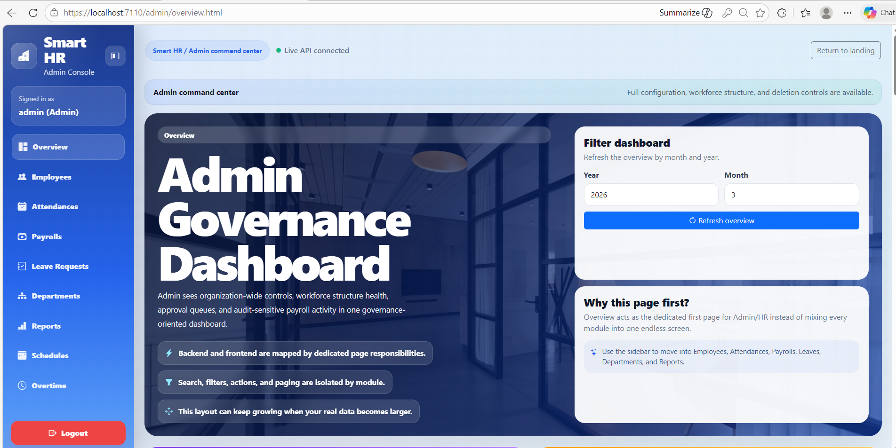

### Payroll Page + AI Assistant
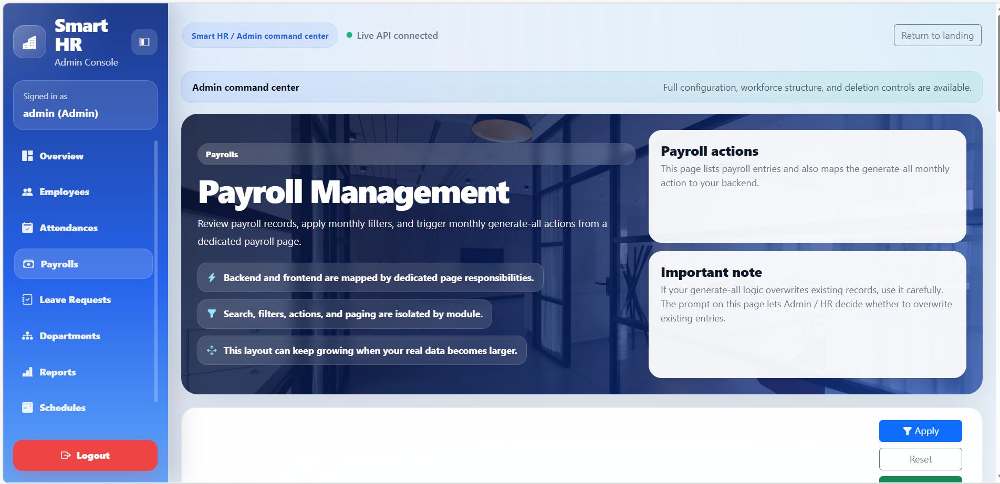
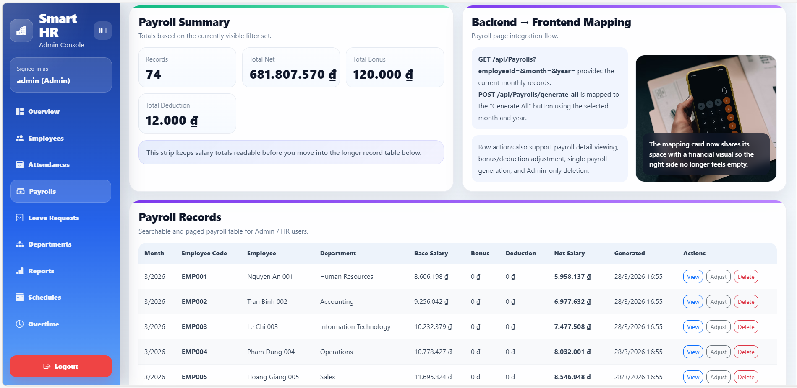

### Reports Dashboard
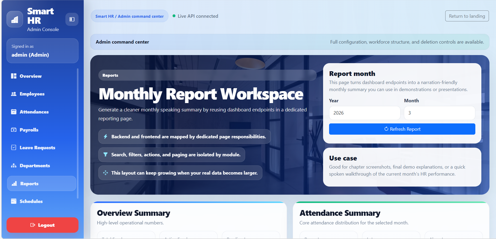
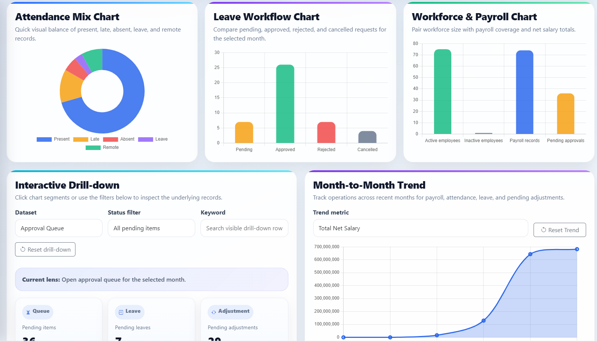
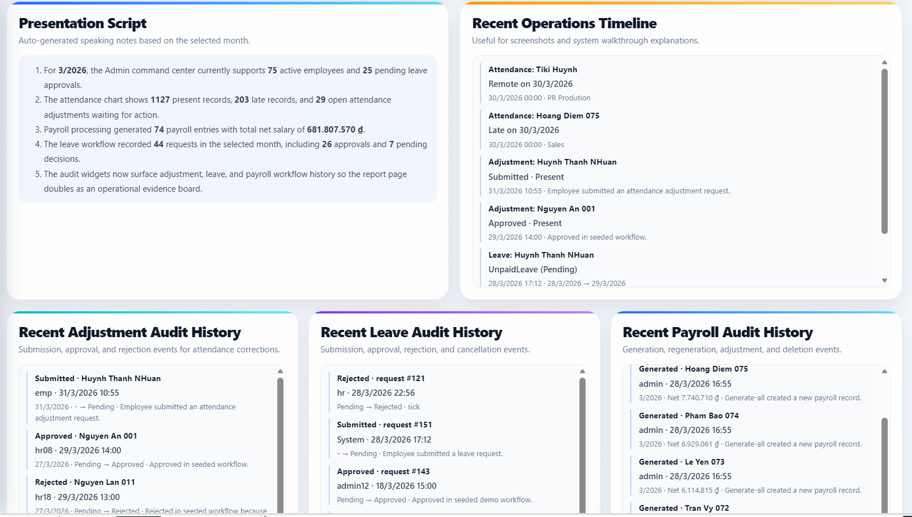

### Leave Approval Workflow
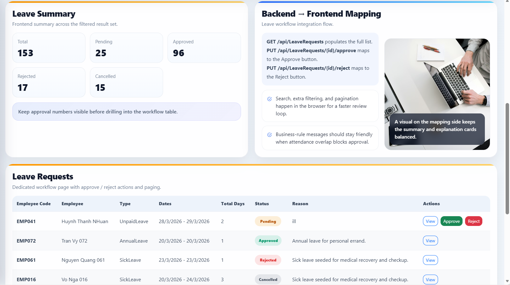

### Shift & Schedule Management
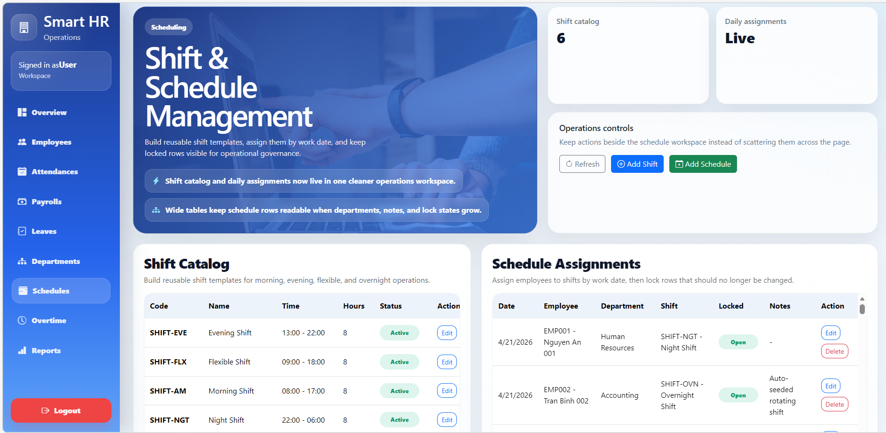

### Employee Self-Service Overview
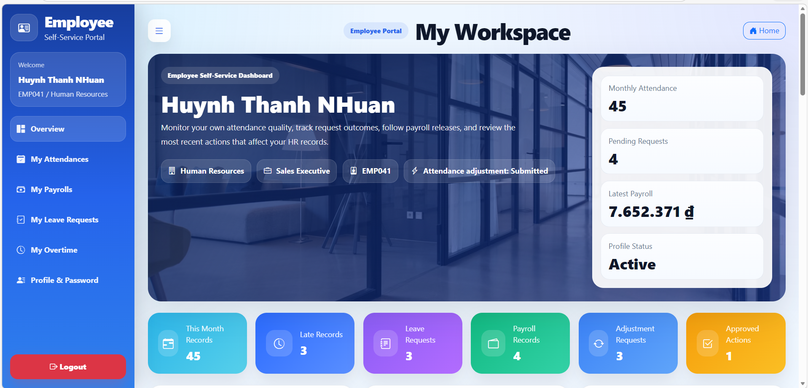
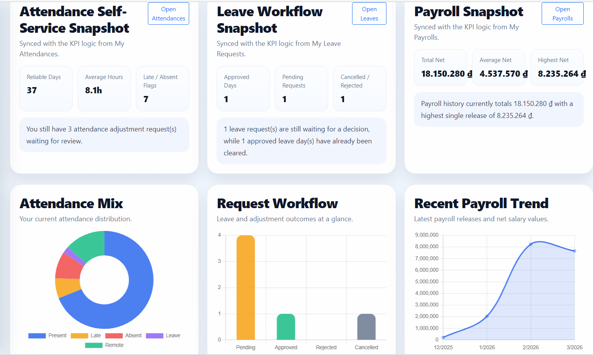
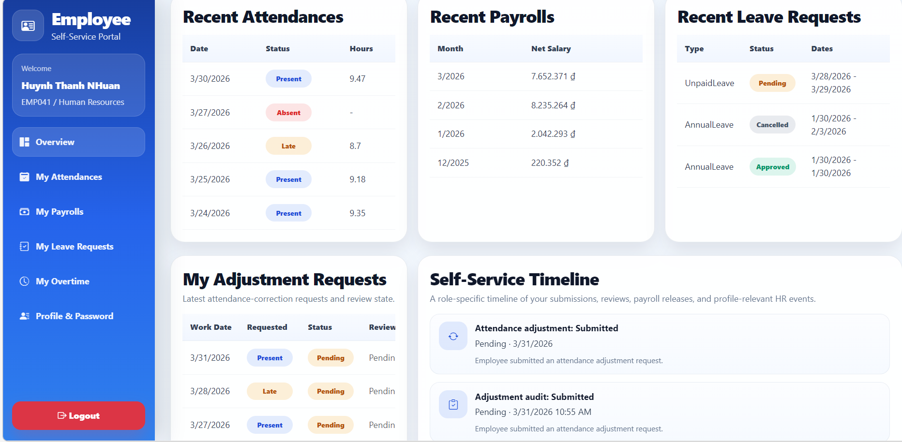

### Employee Payroll Page
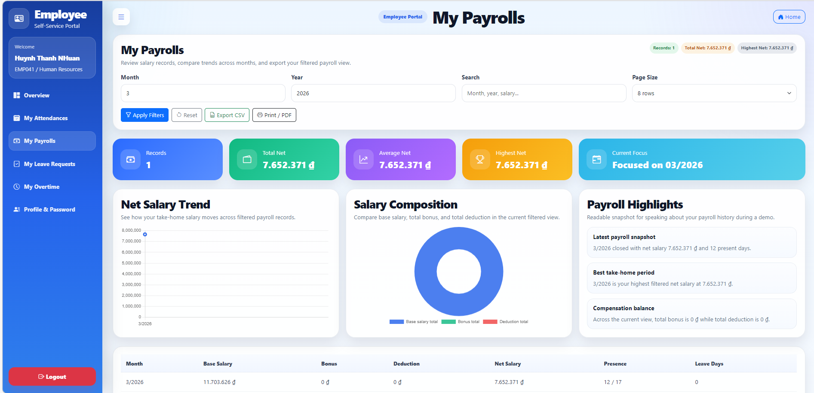

### HR Workspace
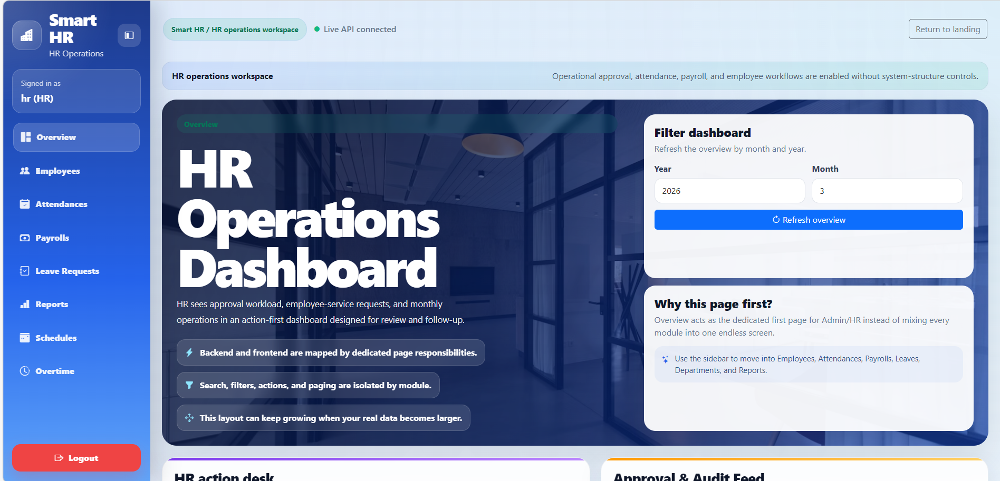
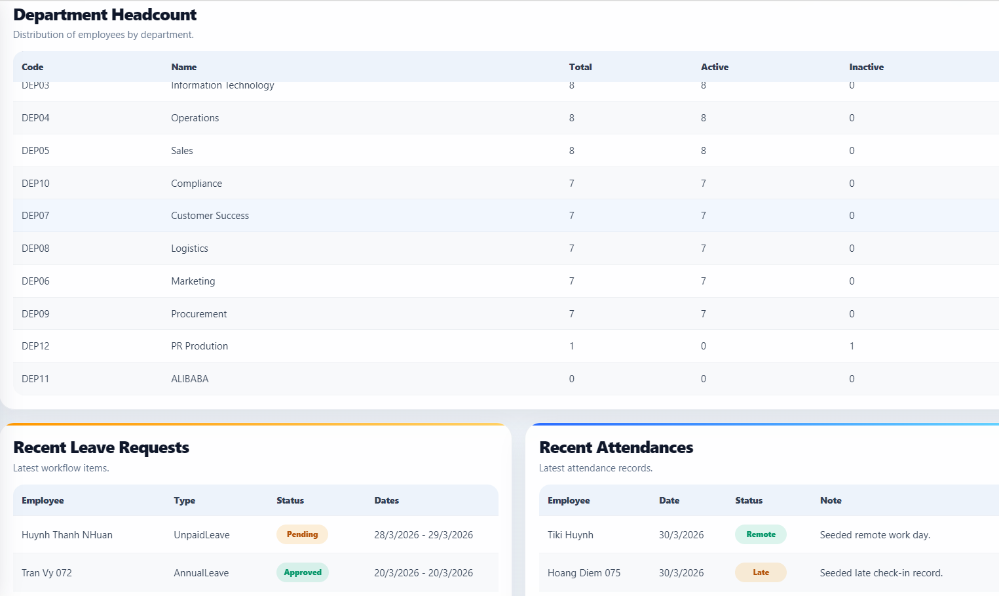
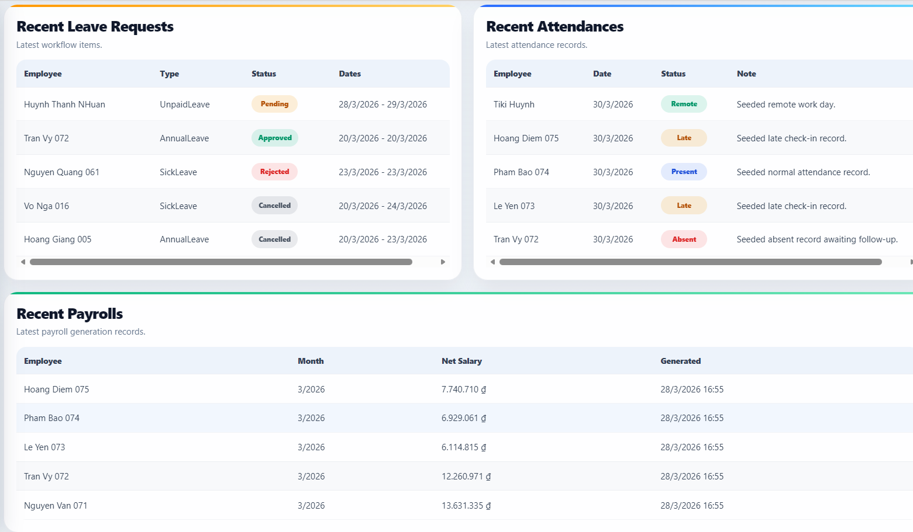

### Manager Approval
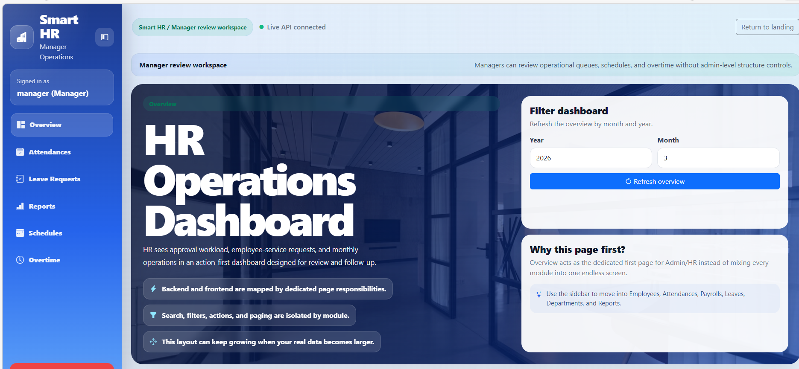
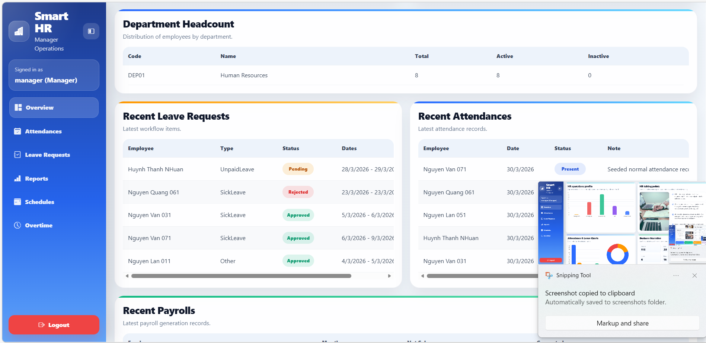

## Demo Accounts / Notes

> Do **not** commit real usernames/passwords to a public repository.  
> For public GitHub usage, describe roles only or use dummy demo credentials.

### Suggested demo roles
- Admin
- HR
- Manager
- Employee

### Demo note
Before demo:
- seed sufficient data
- prepare month/year with good charts
- prepare payroll data for AI summary
- prepare pending leave/overtime items for workflow demo

---

## How to Run Locally

### Prerequisites
Make sure you have:

- .NET 8 SDK
- SQL Server
- Visual Studio or compatible .NET IDE
- Redis (optional but recommended)
- Docker Desktop (optional)

### Run steps
1. Clone the repository
2. Open the solution in Visual Studio
3. Configure `appsettings.json` and `appsettings.Development.json`
4. Check SQL Server connection string
5. Apply migrations if required
6. Seed demo data
7. Run the backend API
8. Open the frontend pages under `wwwroot/admin` or `wwwroot/employee`

### Optional Redis local run
```bash
docker run -d --name smart-hr-redis -p 6379:6379 redis:7-alpine
```

---

## Optional Docker Run

If your current Docker configuration matches your project paths:

```bash
docker compose up -d
or to run only specific services:
docker run -d --name smart-hr-redis -p 6379:6379 redis:7-alpine
or if using docker compose with a compose file:
docker compose -f "your_path_project" up -d redis db
To stop and remove the container:
docker compose -f "your_path_project" stop redis db
```

Typical services:
- API
- SQL Server
- Redis

> Make sure your Dockerfile uses the correct `.csproj` and `.dll` names from your current project.

---

## API Coverage Summary

The current project covers these API areas:

### Auth APIs
- login
- refresh token
- logout
- my profile
- change password

### Dashboard APIs
- overview
- department headcount
- recent leaves
- recent payrolls
- recent attendances
- employee status summary

### Employee APIs
- list/search/filter
- create/update/delete
- my profile update

### Attendance APIs
- list/filter
- create/update/delete
- my attendances
- adjustment workflow support

### Payroll APIs
- list/filter
- generate all
- generate single
- my payrolls
- governance / period direction
- AI summary direction

### Leave APIs
- create request
- query/filter
- approve/reject
- my leave requests
- leave balance direction

### Department / Position APIs
- CRUD operations
- search/filter
- organizational structure support

### Overtime / Schedule / Reports APIs
- workflow-specific support depending on current build stage

---

## Engineering Depth

This project includes more than UI and CRUD.

### Authentication
- JWT auth
- refresh token direction
- logout revoke direction

### Cache
- Redis direction
- dashboard/report/AI summary/leave balance cache support

### Logging & Stability
- structured logging direction
- global exception handling direction
- runtime stabilization effort
- graceful no-data / fallback states

### Audit
- audit-aware operational feeds
- approval/rejection visibility
- self-service timeline direction

### Test Readiness
Strong candidates for unit/integration tests:
- payroll computation
- leave balance policy
- auth flow
- leave approval
- payroll generation
- AI summary endpoint

### Deployment Readiness
- Dockerfile direction
- docker-compose direction
- configuration separation
- portfolio-ready project structure

---

## Suggested Demo Flow

A good 5–7 minute demo can follow this order:

1. Login as **Admin**
2. Show **Admin Overview Dashboard**
3. Open **Payroll page**
4. Show payroll filters, generation actions, and governance block
5. Use **AI Payroll Summary Assistant**
6. Open **Reports page**
7. Login as **Manager**
8. Review a leave or overtime approval flow
9. Login as **Employee**
10. Show self-service overview, payroll, leave, and overtime

### Why this demo flow works
It demonstrates:
- role separation
- workflow depth
- business dashboards
- AI integration
- production-like structure

---

## Future Improvements

Potential next steps:
- finalize payroll period lock backend APIs
- improve integration test separation
- strengthen Docker run consistency
- add email / notification workflow
- add background jobs
- expand AI provider integration
- improve export formats
- improve mobile responsiveness further
- add organization charts and richer manager analytics

---

## Final Note

**Smart HR** is designed to be a **portfolio-ready, business-oriented HR management system**.

It demonstrates:
- multiple business modules
- multiple roles
- workflow-based operations
- business dashboard design
- AI-assisted payroll analysis
- engineering depth beyond a simple student CRUD project
